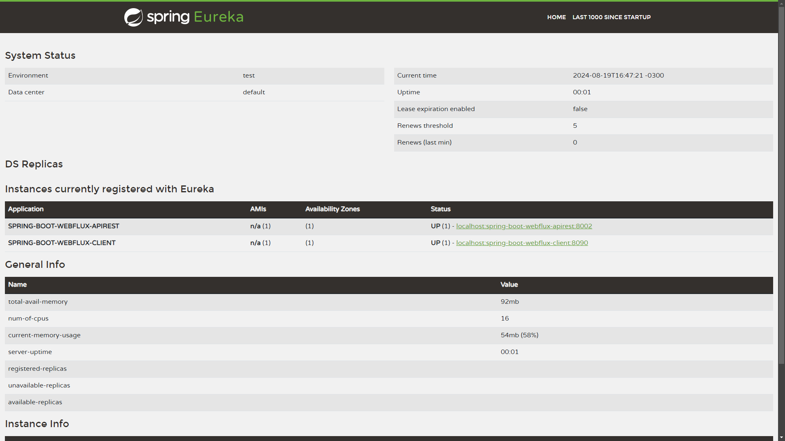

# Reactive Spring Boot

Un proyecto Spring Boot que utiliza WebFlux, diseñado para manejar de manera eficiente múltiples solicitudes al mismo tiempo. 
WebFlux permite realizar operaciones asíncronas sin bloquear el sistema, lo que significa que el proyecto puede continuar procesando otras tareas mientras espera respuestas. 
Además, está preparado para gestionar la carga de datos de manera inteligente, asegurando que los consumidores no se vean abrumados con más información de la que pueden manejar.

Características:
- Flujo de datos continuos asíncronos
- Procesos sin bloqueo (non-blocking)
- Contrapersión o latencia
- Los operadores reducen notablemente las tareas de transformaciones
- Pueden ser creados desde stream listas, intervalos, rangos
- Son cancelables
- Pueden ser finito o infinito
- Son inmutables
- Concurrencia hecho fácil
- Manejo de errores Async
- Al fallar se puede volver a re-intentar

## Tabla de Contenidos

1. [Herramientas](#herramientas-usadas)
2. [Instalación](#instalación)
3. [Testeo](#testeo)
4. [Endpoints](#endpoints)

## Herramientas usadas

- Spring Boot
    - Spring Boot DevTools
    - Spring Reactive Web
    - Spring Data Reactive MongoDB
    - Spring Cloud Netflix
    

## Instalación

Modificar los siguientes archivos:

Se necesita **tener una cuenta en MongoDB** (por ejemplo: en MongoDB Atlas), crear un Clúster y modificar `spring.data.mongodb.uri` en [application.properties](spring-boot-webflux-apirest/src/main/resources/application.properties)

## Testeo

Ejecutar `spring-boot-webflux-eureka-server`, `spring-boot-webflux-client` y `spring-boot-webflux-apirest`

## Endpoints

Desde http://localhost:8090 (spring-boot-webflux-client)

- **GET /api/client**
  - **Descripción:** Obtiene un listado de todos los productos.
  - **Respuesta:**
    - Estado 200 OK
    - Cuerpo de la respuesta: `[ { "id": "ID del producto", "nombre": "Nombre del producto", "precio": "Precio del producto", "createAt": "Fecha de creación" }, ... ]`

- **GET /api/client/{id}**
  - **Descripción:** Muestra los datos de un producto específico por su ID.
  - **Parámetros de ruta:**
    - `id` - ID del producto a buscar.
  - **Respuesta:**
    - Estado 200 OK si el producto se encuentra.
    - Estado 404 Not Found si el producto no se encuentra.
    - Cuerpo de la respuesta: `{ "id": "ID del producto", "nombre": "Nombre del producto", "precio": "Precio del producto", "createAt": "Fecha de creación" }`

- **POST /api/client**
  - **Descripción:** Permite crear un nuevo producto.
  - **Cuerpo de la solicitud:**
    - `{ "nombre": "Nombre del producto", "precio": "Precio del producto", "categoria": { "id": ID de la categoría, "nombre": nombre de la categoría asociada al ID } }`
  - **Precondiciones:**
    - El campo `nombre` no debe estar vacío.
  - **Respuesta:**
    - Estado 201 Created si el producto se crea exitosamente.
    - Estado 400 Bad Request si hay un error en la solicitud.
    - Cuerpo de la respuesta: `{ "id": "ID del producto", "nombre": "Nombre del producto", "precio": "Precio del producto", "createAt": "Fecha de creación" }`

- **PUT /api/client/{id}**
  - **Descripción:** Permite actualizar los datos de un producto existente.
  - **Parámetros de ruta:**
    - `id` - ID del producto a actualizar.
  - **Cuerpo de la solicitud:**
    - `{ "nombre": "Nombre actualizado", "precio": "Precio actualizado", "categoria": { "id": ID de la categoría, "nombre": nombre de la categoría asociada al ID } }`
  - **Precondiciones:**
    - El campo `nombre` no debe estar vacío.
  - **Respuesta:**
    - Estado 201 Created si el producto se actualiza exitosamente.
    - Estado 404 Not Found si el producto no se encuentra.

- **DELETE /api/client/{id}**
  - **Descripción:** Permite eliminar un producto dado su ID.
  - **Parámetros de ruta:**
    - `id` - ID del producto a eliminar.
  - **Respuesta:**
    - Estado 204 No Content si el producto se elimina exitosamente.
    - Estado 404 Not Found si el producto no se encuentra.

- **POST /api/client/upload/{id}**
  - **Descripción:** Permite subir un archivo y asociarlo a un producto existente.
  - **Parámetros de ruta:**
    - `id` - ID del producto al que se asociará el archivo.
  - **Cuerpo de la solicitud:**
    - Archivo: En form-data, la key debe llamarse 'file' de tipo File, pasar Value imagen
  - **Respuesta:**
    - Estado 201 Created si el archivo se sube y asocia exitosamente.
    - Estado 404 Not Found si el producto no se encuentra.
    - Cuerpo de la respuesta: `{ "id": "ID del producto", "nombre": "Nombre del producto", "precio": "Precio del producto", "createAt": "Fecha de creación" }`

## Authors

- [@Juan Ignacio Caprioli (ChanoChoca)](https://github.com/ChanoChoca)

## Badges

[//]: # (Add badges from somewhere like: [shields.io]&#40;https://shields.io/&#41;)

